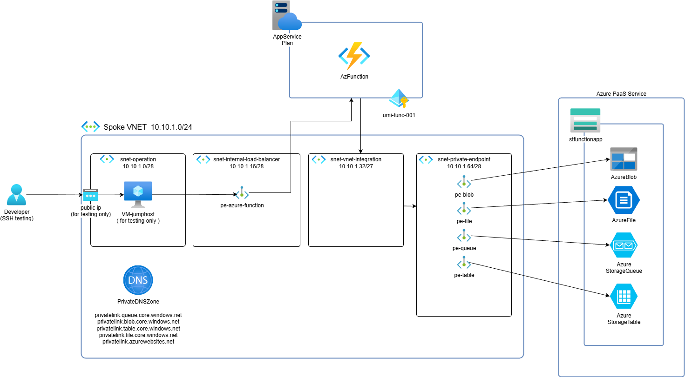

# Azure Function App Terraform Examples

A comprehensive repository demonstrating various Azure Function App deployment patterns using Terraform, including both standard Azure provider and Azure Verified Modules (AVM) approaches.

## 🏗️ Architecture Overview



This repository showcases Azure Function App deployments in private virtual networks with secure connectivity patterns.

## 📋 Table of Contents

- [Overview](#overview)
- [Prerequisites](#prerequisites)
- [Getting Started](#getting-started)
- [Examples](#examples)
- [Repository Structure](#repository-structure)
- [Usage Guidelines](#usage-guidelines)
- [Contributing](#contributing)

## 🔍 Overview

This repository provides practical examples for deploying Azure Function Apps using:

- **Azure Terraform Provider**: Direct resource provisioning using the official HashiCorp Azure provider
- **Azure Verified Modules (AVM)**: Pre-validated, enterprise-ready modules following Microsoft best practices
- **Private Networking**: Secure deployments with private endpoints and VNet integration

## ✅ Prerequisites

Before using these examples, ensure you have:

- [Terraform](https://www.terraform.io/downloads.html) (>= 1.0)
- [Azure CLI](https://docs.microsoft.com/en-us/cli/azure/install-azure-cli) installed and configured
- An active Azure subscription
- Appropriate permissions to create resources in your Azure subscription

## 🚀 Getting Started

1. **Clone the repository**
   ```bash
   git clone <repository-url>
   cd terraform-azure-functionapp-examples
   ```

2. **Choose an example**
   Navigate to the `examples` folder and select the deployment pattern that best fits your needs.
   ```bash
   cd examples/azure-function-appservice-plan
   ```

3. **Configure variables**
   Copy and customize the `terraform.tfvars` file in your chosen example.

4. **Deploy**
   ```bash
   terraform init
   terraform plan
   terraform apply
   ```

## 📁 Examples

The `examples` folder contains four distinct deployment patterns:

### Standard Azure Provider Examples

| Example | Description | Use Case |
|---------|-------------|----------|
| **[azure-function-appservice-plan](examples/azure-function-appservice-plan/)** | Dedicated App Service Plan deployment | Production workloads requiring predictable performance and dedicated compute |
| **[azure-function-flex-consumption](examples/azure-function-flex-consumption/)** | Flex Consumption plan deployment | Cost-optimized serverless computing with automatic scaling |

### Azure Verified Modules (AVM) Examples

| Example | Description | Use Case |
|---------|-------------|----------|
| **[azure-function-avm-appservice-plan](examples/azure-function-avm-appservice-plan/)** | AVM-based dedicated App Service Plan | Enterprise deployments requiring validated, standardized modules |
| **[azure-function-avm-flex-consumption](examples/azure-function-avm-flex-consumption/)** | AVM-based Flex Consumption plan | Enterprise-grade serverless deployments with cost optimization |

### Key Features by Example

- **Private Endpoints**: All examples include secure private endpoint configurations
- **VNet Integration**: Network isolation and secure communication patterns
- **Monitoring**: Built-in observability and logging configurations
- **Security**: Best practices for authentication and access control

## 📂 Repository Structure

```
terraform-azure-functionapp-examples/
├── docs/
│   └── images/
│       └── azure-function-with-private-endpoint.png
├── examples/
│   ├── azure-function-appservice-plan/
│   ├── azure-function-avm-appservice-plan/
│   ├── azure-function-flex-consumption/
│   └── azure-function-avm-flex-consumption/
└── Readme.md
```

Each example folder contains:
- `main.tf` - Primary Terraform configuration
- `variables.tf` - Input variable definitions
- `output.tf` - Output value definitions
- `provider.tf` - Provider configuration
- `terraform.tfvars` - Example variable values
- Individual README with specific deployment instructions

## 📖 Usage Guidelines

### Best Practices

- Review and customize `terraform.tfvars` for your environment
- Understand the networking requirements before deployment
- Consider compliance and security requirements when choosing between examples
- Test in a development environment before production deployment
